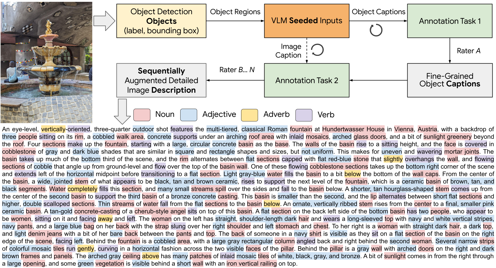
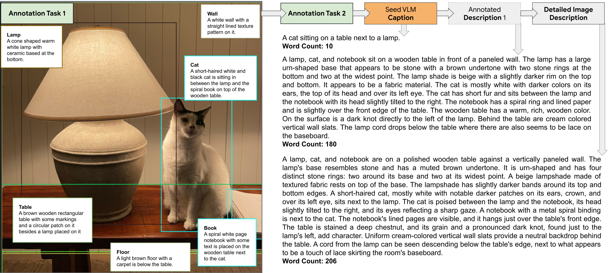

<h2>ImageInWords: Unlocking Hyper-Detailed Image Descriptions</h2> 




arXiv: 

Please visit the [webpage](https://google.github.io/imageinwords) for all the information about the IIW project, data, visualizations, and much more. The data can be downloaded directly from the `datasets/` folder, as well as from Huggingface (see below).

Please reach out to iiw-dataset@google.com for thoughts/feedback/questions/collaborations.

<h3>Other resources</h3>

<h4>&#129303;Hugging Face&#129303;</h4>

<li><a href="https://huggingface.co/datasets/google/imageinwords">Dataset</a></li>

```python
from datasets import load_dataset

# `name` can be one of: IIW-400, DCI_Test, DOCCI_Test, CM_3600, LocNar_Eval
# refer: https://github.com/google/imageinwords/blob/main/datasets/README.md
dataset = load_dataset("google/imageinwords", token="YOUR_HF_ACCESS_TOKEN", name="IIW-400")
```

<li><a href="https://huggingface.co/spaces/google/imageinwords-explorer">Dataset-Explorer</a></li>


